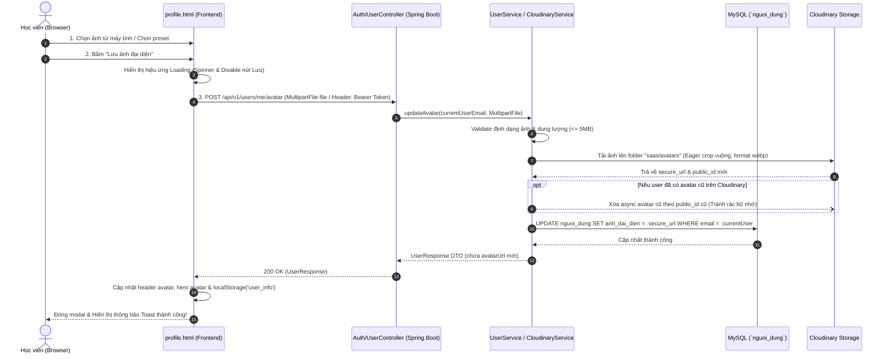

# Kế Hoạch Chuẩn Chuyên Nghiệp: Tích Hợp Upload Avatar Cá Nhân Lên Cloudinary & MySQL

Tài liệu này mô tả chi tiết giải pháp chuẩn hóa cho tính năng **Upload & Cập nhật Ảnh Đại Diện (Avatar)** từ giao diện người dùng ([`UI/student/profile.html`](file:///c:/Users/Admin/Downloads/SAAS/UI/student/profile.html)) lên **Cloudinary** và lưu trữ vĩnh viễn vào **Database MySQL** (`nguoi_dung.anh_dai_dien`).

---

## 🎯 1. Phân Tích Thực Trạng & Mục Tiêu

| Tiêu chí | Hiện tại | Chuẩn Chuyên Nghiệp (Mục tiêu) |
| :--- | :--- | :--- |
| **Nơi lưu trữ** | `localStorage` (chuỗi Base64) | **Cloudinary CDN** (Link HTTPS tối ưu WebP) |
| **Lưu Database** | Không lưu vào Database | Lưu trực tiếp vào cột `anh_dai_dien` bảng `nguoi_dung` |
| **Đồng bộ thiết bị** | Mất ảnh khi đổi máy/trình duyệt | Đăng nhập ở bất kỳ máy nào cũng hiển thị đúng avatar |
| **Hiệu năng & Bộ nhớ** | Base64 làm phình to `localStorage` | Tải qua CDN với cache, thumbnail vuông tự động |
| **Dọn dẹp rác** | Tồn đọng dữ liệu cục bộ | Tự động xóa ảnh cũ trên Cloudinary khi người dùng đổi ảnh mới |

---

## 🔄 2. Sơ Đồ Kiến Trúc & Luồng Dữ Liệu (Mermaid Sequence Diagram)

---

## 🛠️ 3. Chi Tiết Các Bước Triển Khai (Step-by-Step Implementation)

### 📌 Phase 1: Xây Dựng Backend API Atomic (`UserController` / `UserService`)

Thay vì bắt Frontend phải gọi 2 request rời rạc (1 request upload ảnh lên Cloudinary và 1 request lưu URL vào database), chuẩn chuyên nghiệp là thiết kế một **Endpoint nguyên tử (Atomic Endpoint)**:

#### 1. Định nghĩa Endpoint:
- **URL**: `POST /api/v1/users/me/avatar`
- **Method**: `POST`
- **Headers**: `Authorization: Bearer <JWT_TOKEN>`
- **Content-Type**: `multipart/form-data`
- **Request Body**:
  - `file`: `MultipartFile` (ảnh tải lên từ máy tính)
  - `presetUrl`: `String` *(tùy chọn - nếu người dùng chọn avatar có sẵn trong kho mẫu)*

#### 2. Xử lý nghiệp vụ tại Service (`UserServiceImpl`):
- Lấy email người dùng hiện tại qua `SecurityUtil.getCurrentUserLogin()`.
- Nếu tải file lên:
  - Validate định dạng: `image/jpeg`, `image/png`, `image/webp`. Dung lượng $\le 5\text{MB}$.
  - Gọi `cloudinaryService.uploadImage(file, "saas/avatars")`.
- Cập nhật trường `user.setAvatarUrl(newUrl)`.
- Lưu vào Database: `userRepository.save(user)`.
- Trả về `UserResponse` cập nhật mới nhất.

---

### 📌 Phase 2: Cập Nhật Phân Quyền Bảo Mật (`SecurityConfiguration.java`)
- Yêu cầu endpoint `/api/v1/users/me/avatar` phải xác thực (`.authenticated()`) để đảm bảo chỉ chính chủ tài khoản mới cập nhật được ảnh của mình.

---

### 📌 Phase 3: Kết Nối Giao Diện Frontend ([`profile.html`](file:///c:/Users/Admin/Downloads/SAAS/UI/student/profile.html))

Cập nhật hàm lưu avatar `avatarModalSave.addEventListener('click', ...)`:
1. **Kiểm tra trạng thái đăng nhập**: Lấy `auth_token` từ `localStorage`.
2. **Hiệu ứng UX chuyên nghiệp**:
   - Hiển thị spinner: `<i class="fa-solid fa-spinner fa-spin"></i> Đang tải lên...`
   - Khóa nút bấm (disable) để chống spam click (double request).
3. **Gọi API Backend**:
   - Dùng `fetch('/api/v1/users/me/avatar', { method: 'POST', body: formData, headers: { Authorization: 'Bearer ' + token } })`.
4. **Xử lý phản hồi**:
   - Thành công: Đồng bộ ngay URL mới lên ảnh đại diện trên thanh Header, ảnh đại diện lớn góc trái và menu dropdown. Cập nhật lại object `user_info` trong `localStorage`.
   - Thất bại: Hiển thị Toast thông báo lỗi chi tiết từ server.
   - Reset lại trạng thái nút bấm và đóng modal.

---

## 📋 4. Kế Hoạch Kiểm Thử (QA & Validation)

1. **Test Case 1 (Upload bình thường)**: Tải ảnh PNG 2MB -> Kiểm tra ảnh hiển thị đúng trên UI, link HTTPS Cloudinary lưu trong MySQL, không bị mất khi F5 hoặc đổi trình duyệt.
2. **Test Case 2 (File quá cỡ hoặc sai định dạng)**: Tải file `.pdf` hoặc ảnh > 5MB -> Trả về lỗi 400 và Toast cảnh báo rõ ràng, không làm crash server.
3. **Test Case 3 (Chọn ảnh mẫu Preset)**: Bấm chọn 1 avatar mẫu có sẵn -> Lưu đúng link mẫu vào database.
4. **Test Case 4 (Chưa đăng nhập)**: Nếu token hết hạn hoặc chưa đăng nhập -> Hiển thị thông báo và điều hướng đến modal đăng nhập.

---

## 🚀 Trạng Thái Sẵn Sàng Triển Khai
Kế hoạch này tuân thủ trọn vẹn:
- Cấu trúc kiến trúc Clean Architecture của Spring Boot.
- Không để lộ Secret Key Cloudinary ở Frontend.
- Tối ưu trải nghiệm người dùng (UX) với feedback rõ ràng (loading, disable button, toast).
