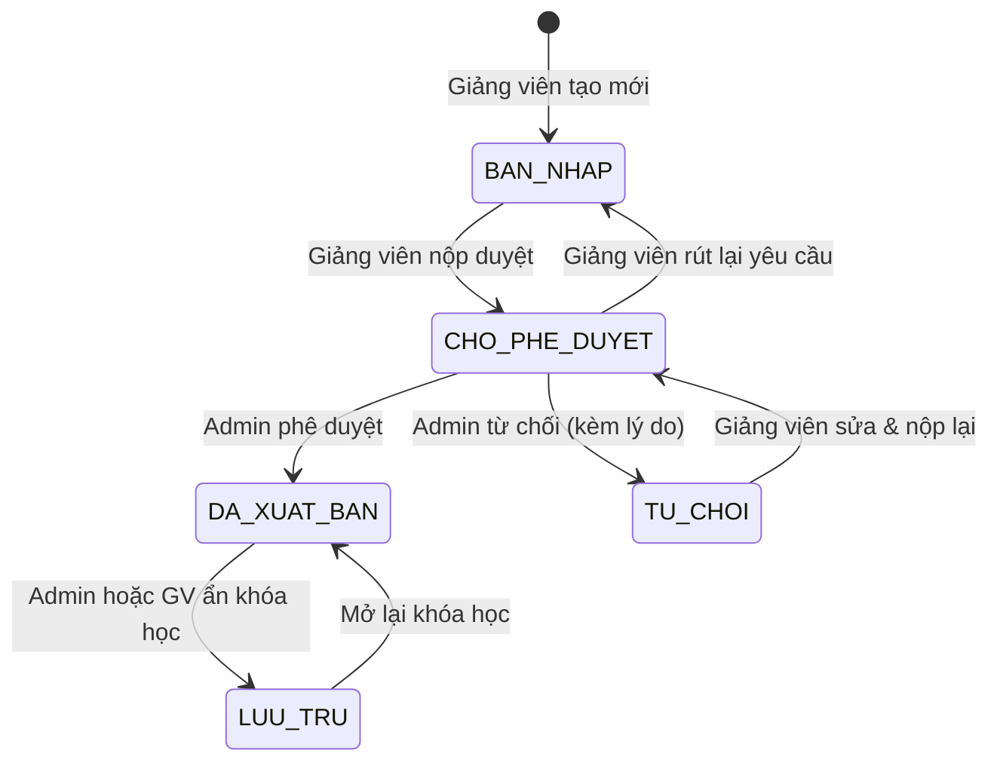

# Kế Hoạch Chuẩn Chuyên Nghiệp: Xây Dựng Hệ Thống CRUD Khóa Học (Course Management)

Tài liệu này mô tả chi tiết kiến trúc, thiết kế RESTful API, mô hình dữ liệu và lộ trình triển khai tính năng **CRUD Khóa Học (Courses)** cho nền tảng E-Learning SaaS, hỗ trợ đa phân quyền (**Admin**, **Giảng Viên / Instructor**, **Học Viên / Student / Khách vãng lai**).

---

## 🎯 1. Phân Tích Nghiệp Vụ & Ma Trận Phân Quyền (RBAC)

### 1.1. Các trạng thái vòng đời của khóa học (`trang_thai`)
Theo thiết kế chuẩn trong cơ sở dữ liệu (`schema.sql`):


- **`BAN_NHAP` (Draft)**: Khóa học mới tạo, chỉ giảng viên sở hữu và Admin xem được.
- **`CHO_PHE_DUYET` (Pending)**: Khóa học đã soạn xong, đang chờ Admin kiểm duyệt nội dung.
- **`DA_PHE_DUYET` / `DA_XUAT_BAN` (Published)**: Khóa học hiển thị công khai trên trang chủ và danh mục cho học viên tìm kiếm và mua.
- **`TU_CHOI` (Rejected)**: Bị từ chối do vi phạm quy chuẩn, kèm `ly_do_tu_choi` để giảng viên chỉnh sửa.
- **`LUU_TRU` (Archived)**: Tạm dừng bán hoặc lưu trữ nội bộ.

### 1.2. Ma trận phân quyền theo vai trò (Role-Based Access Control)

| Tính năng | Khách / Học viên (`ROLE_USER`) | Giảng viên (`ROLE_INSTRUCTOR`) | Quản trị viên (`ROLE_ADMIN`) |
| :--- | :---: | :---: | :---: |
| **Xem danh sách & Lọc khóa học** | ✅ Chỉ xem khóa `DA_XUAT_BAN` | ✅ Xem khóa public + khóa của chính mình | ✅ Toàn quyền xem mọi trạng thái |
| **Xem chi tiết khóa học** | ✅ Xem public (giá, đề cương) | ✅ Xem chi tiết khóa của mình | ✅ Toàn quyền xem mọi khóa học |
| **Tạo khóa học mới** | ❌ Không có quyền | ✅ Tạo khóa mới (trạng thái `BAN_NHAP`) | ✅ Tạo khóa học |
| **Sửa thông tin khóa học** | ❌ Không có quyền | ✅ Chỉ sửa khóa do chính mình tạo | ✅ Toàn quyền sửa |
| **Upload Thumbnail / Trailer** | ❌ Không có quyền | ✅ Upload cho khóa học của mình | ✅ Toàn quyền upload |
| **Gửi yêu cầu phê duyệt** | ❌ Không có quyền | ✅ Gửi khóa của mình lên Admin | ➖ Tự động duyệt |
| **Phê duyệt / Từ chối khóa học** | ❌ Không có quyền | ❌ Không có quyền | ✅ Duyệt hoặc Từ chối kèm lý do |
| **Xóa khóa học** | ❌ Không có quyền | ✅ Xóa khóa `BAN_NHAP` của mình | ✅ Xóa hoặc chuyển vào `LUU_TRU` |

---

## 🗄️ 2. Thiết Kế Cơ Sở Dữ Liệu & Entity JPA

### 2.1. Cấu trúc bảng `khoa_hoc` (Theo `schema.sql`)
- `id`: `BIGINT AUTO_INCREMENT PRIMARY KEY`
- `ma_giang_vien`: `BIGINT NOT NULL` (Khóa ngoại `nguoi_dung.id`)
- `ma_danh_muc`: `BIGINT NOT NULL` (Khóa ngoại `danh_muc.id`)
- `tieu_de`: `VARCHAR(255) NOT NULL`
- `duong_dan`: `VARCHAR(300) NOT NULL UNIQUE` (Slug URL thân thiện SEO, vd: `tieng-anh-giao-tiep-cap-toc`)
- `tieu_de_phu`: `VARCHAR(500)`
- `mo_ta_chi_tiet`: `LONGTEXT`
- `anh_dai_dien`: `VARCHAR(500)` (Ảnh thumbnail Cloudinary)
- `video_gioi_thieu`: `VARCHAR(500)` (Video intro Cloudinary/YouTube)
- `gia_goc`: `DECIMAL(12, 2) NOT NULL DEFAULT 0.00`
- `gia_khuyen_mai`: `DECIMAL(12, 2) DEFAULT 0.00`
- `trinh_do`: `ENUM('CO_BAN', 'TRUNG_CAP', 'NANG_CAO', 'TAT_CA') DEFAULT 'TAT_CA'`
- `ngon_ngu`: `VARCHAR(50) DEFAULT 'Tiếng Việt'`
- `trang_thai`: `ENUM('BAN_NHAP', 'CHO_PHE_DUYET', 'DA_PHE_DUYET', 'TU_CHOI', 'DA_XUAT_BAN', 'LUU_TRU')`
- `ly_do_tu_choi`: `TEXT`
- `tong_thoi_luong_giay`: `INT DEFAULT 0`
- `tong_so_bai_hoc`: `INT DEFAULT 0`
- `ngay_tao`, `ngay_cap_nhat`: `TIMESTAMP`

### 2.2. Các Entity & Enums cần tạo trong Backend
1. **`Course.java`** (`@Table(name = "khoa_hoc")`)
   - `@ManyToOne` với `User instructor` (khóa ngoại `ma_giang_vien`)
   - `@ManyToOne` với `Category category` (khóa ngoại `ma_danh_muc`)
   - `@Enumerated(EnumType.STRING)` cho `CourseLevel` và `CourseStatus`
2. **`Category.java`** (`@Table(name = "danh_muc")`)
3. **`CourseStatus.java`**: Enum các trạng thái kiểm duyệt
4. **`CourseLevel.java`**: Enum trình độ học viên (`CO_BAN`, `TRUNG_CAP`, `NANG_CAO`, `TAT_CA`)

---

## 📡 3. Thiết Kế RESTful API Endpoints

Hệ thống API được phân định rõ ràng theo tiền tố `/api/v1`:

### 🌐 3.1. Public APIs (Dành cho Học viên & Khách)

| Method | Endpoint | Quyền | Mô tả |
| :--- | :--- | :---: | :--- |
| `GET` | `/api/v1/courses` | Public | Lấy danh sách khóa học có phân trang, lọc đa tiêu chí (keyword, category, price, level), sắp xếp. |
| `GET` | `/api/v1/courses/{slugOrId}` | Public | Lấy thông tin chi tiết một khóa học đang xuất bản theo Slug hoặc ID. |
| `GET` | `/api/v1/categories` | Public | Lấy danh sách danh mục khóa học (để hiển thị bộ lọc/dropdown). |

#### Tham số Query cho `GET /api/v1/courses`:
- `keyword`: Tìm theo tiêu đề hoặc mô tả (Fulltext search / Like)
- `categoryId`: Lọc theo danh mục
- `level`: `CO_BAN` | `TRUNG_CAP` | `NANG_CAO` | `TAT_CA`
- `priceFilter`: `all` | `free` | `paid`
- `page`: Trang hiện tại (mặc định: `0`)
- `size`: Số bản ghi mỗi trang (mặc định: `12`)
- `sort`: Tiêu chí sắp xếp (`newest`, `price-asc`, `price-desc`, `popular`)

---

### 👨‍🏫 3.2. Instructor APIs (Kênh Giảng Viên - Quản lý khóa học của mình)

| Method | Endpoint | Quyền | Mô tả |
| :--- | :--- | :---: | :--- |
| `GET` | `/api/v1/instructor/courses` | `ROLE_INSTRUCTOR` | Lấy danh sách các khóa học do chính giảng viên đó tạo. |
| `GET` | `/api/v1/instructor/courses/{id}` | `ROLE_INSTRUCTOR` | Lấy chi tiết khóa học của mình để đưa vào form chỉnh sửa. |
| `POST` | `/api/v1/instructor/courses` | `ROLE_INSTRUCTOR` | Tạo mới một khóa học (Tự động gán trạng thái `BAN_NHAP`). |
| `PUT` | `/api/v1/instructor/courses/{id}` | `ROLE_INSTRUCTOR` | Cập nhật thông tin khóa học (chỉ sửa khi là `BAN_NHAP` hoặc `TU_CHOI`). |
| `POST` | `/api/v1/instructor/courses/{id}/thumbnail` | `ROLE_INSTRUCTOR` | Tải lên ảnh bìa đại diện cho khóa học (Upload Cloudinary). |
| `PATCH` | `/api/v1/instructor/courses/{id}/submit-approval`| `ROLE_INSTRUCTOR` | Gửi yêu cầu kiểm duyệt lên Admin (`CHO_PHE_DUYET`). |
| `DELETE` | `/api/v1/instructor/courses/{id}` | `ROLE_INSTRUCTOR` | Xóa khóa học bản nháp của mình. |

---

### 🛡️ 3.3. Admin APIs (Kênh Quản Trị Viên - Kiểm duyệt & Quản trị hệ thống)

| Method | Endpoint | Quyền | Mô tả |
| :--- | :--- | :---: | :--- |
| `GET` | `/api/v1/admin/courses` | `ROLE_ADMIN` | Lấy toàn bộ khóa học trong hệ thống (lọc theo trạng thái duyệt, giảng viên). |
| `PATCH` | `/api/v1/admin/courses/{id}/approve` | `ROLE_ADMIN` | Phê duyệt khóa học -> Trạng thái đổi thành `DA_XUAT_BAN`. |
| `PATCH` | `/api/v1/admin/courses/{id}/reject` | `ROLE_ADMIN` | Từ chối khóa học -> Kèm `ly_do_tu_choi` và đổi thành `TU_CHOI`. |
| `PATCH` | `/api/v1/admin/courses/{id}/archive` | `ROLE_ADMIN` | Đưa khóa học vào diện lưu trữ / ngừng kinh doanh (`LUU_TRU`). |
| `DELETE` | `/api/v1/admin/courses/{id}` | `ROLE_ADMIN` | Xóa vĩnh viễn khóa học (nếu chưa có học viên nào đăng ký học). |

---

## 🏗️ 4. Thiết Kế Kiến Trúc Lớp Backend (Spring Boot 3 / Java 17)

```
backend/src/main/java/com/mycompany/saas/
├── domain/
│   ├── Course.java                      # JPA Entity bảng khoa_hoc
│   ├── Category.java                    # JPA Entity bảng danh_muc
│   ├── CourseStatus.java                # Enum trạng thái khóa học
│   ├── CourseLevel.java                 # Enum trình độ
│   ├── request/
│   │   ├── CourseCreateRequest.java     # Request body khi tạo mới
│   │   ├── CourseUpdateRequest.java     # Request body khi cập nhật
│   │   ├── CourseApprovalRequest.java   # Request duyệt/từ chối kèm ghi chú
│   │   └── CourseFilterCriteria.java    # Bộ lọc tìm kiếm động
│   └── response/
│       ├── CourseSummaryResponse.java   # Response rút gọn cho trang danh sách
│       ├── CourseDetailResponse.java    # Response đầy đủ cho trang chi tiết
│       └── PageResponse.java            # Bọc kết quả phân trang chuẩn
├── repository/
│   ├── CourseRepository.java            # JpaRepository & JpaSpecificationExecutor
│   └── CategoryRepository.java          # JpaRepository danh mục
├── service/
│   ├── CourseService.java               # Interface nghiệp vụ Course
│   └── impl/
│       └── CourseServiceImpl.java       # Triển khai nghiệp vụ CRUD, Slug, Bảo mật
├── util/
│   └── SlugUtils.java                   # Tiện ích sinh slug không dấu thân thiện URL
└── controller/
    ├── CourseController.java            # Public API (/api/v1/courses)
    ├── InstructorCourseController.java  # Giảng viên API (/api/v1/instructor/courses)
    └── AdminCourseController.java       # Quản trị viên API (/api/v1/admin/courses)
```

---

## 🔒 5. Các Ràng Buộc Nghiệp Vụ & Bảo Mật Trọng Yếu

1. **Chống lỗi IDOR (Insecure Direct Object References)**:
   - Trong `CourseServiceImpl`, khi thực hiện `updateCourse`, `deleteCourse`, `uploadThumbnail`:
   - Phải kiểm tra: `course.getInstructor().getId().equals(currentUser.getId())` hoặc user có role `ROLE_ADMIN`.
   - Nếu không thỏa mãn -> Ném ngoại lệ `AccessDeniedException` (HTTP 403 Forbidden).
2. **Xử lý Slug URL tự động & Duy nhất**:
   - Tự động chuyển tiếng Việt có dấu thành không dấu (vd: `Khóa học React & Next.js` -> `khoa-hoc-react-next-js`).
   - Nếu bị trùng slug trong DB, tự động nối thêm hậu tố ngẫu nhiên hoặc số đếm (vd: `khoa-hoc-react-next-js-1`).
3. **Kiểm tra tính hợp lệ của Giá tiền**:
   - `gia_goc >= 0`
   - `gia_khuyen_mai <= gia_goc` (Không cho phép giá khuyến mãi cao hơn giá gốc).
4. **Bảo vệ toàn vẹn dữ liệu khi xóa (Data Integrity)**:
   - Nếu khóa học đã có học viên đăng ký (`dang_ky_khoa_hoc`), không cho phép `HARD DELETE` (xóa cứng khỏi DB) mà bắt buộc chuyển sang trạng thái `LUU_TRU` để đảm bảo quyền lợi học tập của học viên cũ.

---

## 📅 6. Lộ Trình Triển Khai Chi Tiết (5 Bước)

```mermaid
gantt
    title Kế hoạch triển khai CRUD Khóa Học
    dateFormat  X
    axisFormat %d
    section Backend Core
    Bước 1 - Entity & Enum & Repository       :active, 0, 1
    Bước 2 - DTOs & Validation & SlugUtils   : 1, 2
    Bước 3 - Service Layer & Nghiệp vụ RBAC  : 2, 3
    Bước 4 - REST Controllers & Security      : 3, 4
    section Testing & UI
    Bước 5 - Viết Unit Test & Tích hợp UI     : 4, 5
```



### **Bước 1: Mô hình hóa Dữ liệu (Entity & Repository)**
- Tạo `Category.java`, `Course.java`, `CourseStatus.java`, `CourseLevel.java`.
- Tạo `CourseRepository.java` kế thừa `JpaRepository<Course, Long>` và `JpaSpecificationExecutor<Course>`.

### **Bước 2: Xây dựng DTOs, Bean Validation & Tiện ích Slug**
- Viết `CourseCreateRequest`, `CourseUpdateRequest`, `CourseDetailResponse`.
- Bổ sung validation Jakarta (`@NotBlank`, `@PositiveOrZero`, `@Size`).
- Viết `SlugUtils.java` chuyển đổi chuỗi tiếng Việt thành slug URL.

### **Bước 3: Tầng Nghiệp Vụ (Service Layer)**
- Viết `CourseService` và `CourseServiceImpl`.
- Cài đặt tìm kiếm động với `Specification` (hỗ trợ search đa điều kiện).
- Triển khai logic kiểm tra quyền sở hữu của Giảng viên.
- Tích hợp `CloudinaryService` cho tính năng tải lên Thumbnail khóa học.

### **Bước 4: Tầng Điều Khiển & Phân Quyền (Controllers & Spring Security)**
- Viết `CourseController` (Public endpoints).
- Viết `InstructorCourseController` (`@PreAuthorize("hasAnyRole('INSTRUCTOR', 'ADMIN')")`).
- Viết `AdminCourseController` (`@PreAuthorize("hasRole('ADMIN')")`).
- Đăng ký các matchers trong `SecurityConfiguration.java`.

### **Bước 5: Kiểm Thử & Kết Nối Giao Diện Frontend**
- Viết Unit Test bằng Mockito + JUnit 5 kiểm tra các kịch bản thành công và ngoại lệ (quyền truy cập, trùng lặp, giá không hợp lệ).
- Tích hợp API vào [course-builder.html](file:///c:/Users/Admin/Downloads/SAAS/UI/instructor/course-builder.html) và [courses-approval.html](file:///c:/Users/Admin/Downloads/SAAS/UI/admin/courses-approval.html).
- Đổ dữ liệu thật ra [courses.html](file:///c:/Users/Admin/Downloads/SAAS/UI/courses.html) và [course-detail.html](file:///c:/Users/Admin/Downloads/SAAS/UI/course-detail.html).
