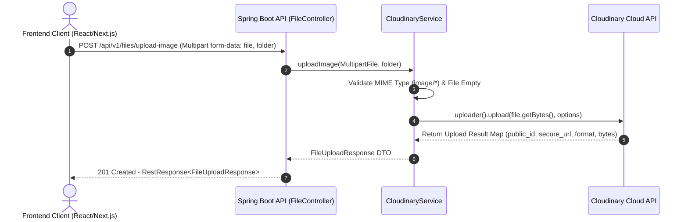
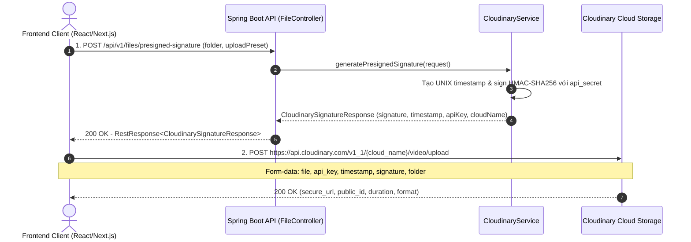

# Tài Liệu Hướng Dẫn & Sơ Đồ Liên Kết: Backend API Upload File & Video Cloudinary

Tài liệu này bao gồm chi tiết **Sơ đồ liên kết (Sequence Diagrams)**, cấu trúc mã nguồn đã triển khai trong Spring Boot (`com.mycompany.saas`), và **Hướng dẫn sử dụng API (cURL, Postman & React/Next.js Client Integration)**.

---

## 🔄 1. Sơ Đồ Liên Kết (Interaction & Sequence Diagrams)

### 📊 Sơ Đồ 1: Server Proxy Upload (Dành cho Hình ảnh & File Nhỏ/Trung bình)
Ở phương thức này, Frontend gửi file trực tiếp tới Backend Spring Boot. Spring Boot kiểm tra validation, nén/chuyển tiếp file tới Cloudinary và trả về metadata (`secure_url`, `public_id`).



---

### 🚀 Sơ Đồ 2: Direct Client Upload với Presigned Signature (Dành cho Video Dung Lượng Lớn)
Đối với Video dung lượng lớn (100MB - hàng GB), Frontend sẽ xin **Presigned Signature** từ Spring Boot API, sau đó tải video trực tiếp lên Cloudinary. Cách này giúp tránh nghẽn băng thông và không gây treo thread server backend.



---

## ⚙️ 2. Cấu Trúc Mã Nguồn Đã Triển Khai

| Thành phần | Đường dẫn File | Mô tả |
| :--- | :--- | :--- |
| **Dependency** | [`build.gradle.kts`](file:///c:/Users/Admin/Downloads/SAAS/backend/build.gradle.kts) | Khai báo `com.cloudinary:cloudinary-http44:1.39.0` |
| **Properties** | [`application.properties`](file:///c:/Users/Admin/Downloads/SAAS/backend/src/main/resources/application.properties) | Cấu hình `cloudinary.cloud-name`, `api-key`, `api-secret`, multipart limit 200MB |
| **Cloudinary Bean** | [`CloudinaryConfig.java`](file:///c:/Users/Admin/Downloads/SAAS/backend/src/main/java/com/mycompany/saas/config/CloudinaryConfig.java) | Bean khởi tạo `com.cloudinary.Cloudinary` |
| **DTO Responses** | [`FileUploadResponse.java`](file:///c:/Users/Admin/Downloads/SAAS/backend/src/main/java/com/mycompany/saas/domain/response/FileUploadResponse.java)<br/>[`CloudinarySignatureResponse.java`](file:///c:/Users/Admin/Downloads/SAAS/backend/src/main/java/com/mycompany/saas/domain/response/CloudinarySignatureResponse.java) | Java Records đóng gói kết quả upload & signature |
| **DTO Request** | [`PresignedSignatureRequest.java`](file:///c:/Users/Admin/Downloads/SAAS/backend/src/main/java/com/mycompany/saas/domain/request/PresignedSignatureRequest.java) | DTO nhận tham số tạo chữ ký upload |
| **Service Layer** | [`CloudinaryService.java`](file:///c:/Users/Admin/Downloads/SAAS/backend/src/main/java/com/mycompany/saas/service/CloudinaryService.java)<br/>[`CloudinaryServiceImpl.java`](file:///c:/Users/Admin/Downloads/SAAS/backend/src/main/java/com/mycompany/saas/service/impl/CloudinaryServiceImpl.java) | Xử lý nghiệp vụ upload image/video, tạo chữ ký và xóa file |
| **Controller** | [`FileController.java`](file:///c:/Users/Admin/Downloads/SAAS/backend/src/main/java/com/mycompany/saas/controller/FileController.java) | Endpoint REST API tại `/api/v1/files` |
| **Security Config** | [`SecurityConfiguration.java`](file:///c:/Users/Admin/Downloads/SAAS/backend/src/main/java/com/mycompany/saas/config/SecurityConfiguration.java) | Cấu hình phân quyền truy cập endpoint |
| **Unit Test** | [`FileControllerTest.java`](file:///c:/Users/Admin/Downloads/SAAS/backend/src/test/java/com/mycompany/saas/FileControllerTest.java) | Kiểm thử tự động các trường hợp validation & signature |

---

## 📖 3. Hướng Dẫn Sử Dụng API (Usage Guide)

### 3.1. Upload Hình Ảnh (Image Upload)
- **Endpoint**: `POST /api/v1/files/upload-image`
- **Content-Type**: `multipart/form-data`
- **Parameters**:
  - `file`: File ảnh (bắt buộc). Định dạng hỗ trợ: JPG, PNG, WEBP, GIF, SVG.
  - `folder` *(tùy chọn)*: Tên thư mục lưu trên Cloudinary (VD: `saas/avatars`). Mặc định: `saas/images`.

#### Ví dụ cURL:
```bash
curl -X POST "http://localhost:8080/api/v1/files/upload-image?folder=saas/avatars" \
  -H "Authorization: Bearer <YOUR_JWT_TOKEN>" \
  -F "file=@/path/to/avatar.png"
```

#### Response mẫu (`201 Created`):
```json
{
  "statusCode": 201,
  "error": null,
  "message": "Tải hình ảnh lên thành công",
  "data": {
    "publicId": "saas/avatars/ab123cd456",
    "url": "https://res.cloudinary.com/demo/image/upload/v1727500000/saas/avatars/ab123cd456.png",
    "format": "png",
    "resourceType": "image",
    "bytes": 524288,
    "duration": null,
    "createdAt": "2026-09-28T12:00:00Z"
  }
}
```

---

### 3.2. Upload Video Qua Server Backend
- **Endpoint**: `POST /api/v1/files/upload-video`
- **Content-Type**: `multipart/form-data`
- **Parameters**:
  - `file`: File video (bắt buộc). Định dạng hỗ trợ: MP4, MOV, AVI, WEBM.
  - `folder` *(tùy chọn)*: Thư mục trên Cloudinary. Mặc định: `saas/videos`.

#### Ví dụ cURL:
```bash
curl -X POST "http://localhost:8080/api/v1/files/upload-video?folder=saas/courses" \
  -H "Authorization: Bearer <YOUR_JWT_TOKEN>" \
  -F "file=@/path/to/lecture.mp4"
```

---

### 3.3. Upload File Âm Thanh / MP3 Qua Server Backend (Audio Upload)
- **Endpoint**: `POST /api/v1/files/upload-audio`
- **Content-Type**: `multipart/form-data`
- **Parameters**:
  - `file`: File âm thanh (bắt buộc). Định dạng hỗ trợ: MP3, WAV, AAC, M4A, OGG.
  - `folder` *(tùy chọn)*: Thư mục trên Cloudinary. Mặc định: `saas/audios`.

#### Ví dụ cURL:
```bash
curl -X POST "http://localhost:8080/api/v1/files/upload-audio?folder=saas/audios" \
  -H "Authorization: Bearer <YOUR_JWT_TOKEN>" \
  -F "file=@/path/to/song.mp3"
```

---

### 3.4. Lấy Presigned Signature Cho Direct Upload Video/Audio (Frontend -> Cloudinary)
- **Endpoint**: `POST /api/v1/files/presigned-signature`
- **Content-Type**: `application/json`

#### Request Body mẫu:
```json
{
  "folder": "saas/courses/videos",
  "uploadPreset": "ml_default"
}
```

#### Response mẫu (`200 OK`):
```json
{
  "statusCode": 200,
  "error": null,
  "message": "Tạo chữ ký upload trực tiếp thành công",
  "data": {
    "signature": "c5a5b28793b890987f2e1a2b...",
    "timestamp": 1727532400,
    "apiKey": "1234567890",
    "cloudName": "your_cloud_name",
    "folder": "saas/courses/videos"
  }
}
```

---

### 3.4. Xóa File Trên Cloudinary
- **Endpoint**: `DELETE /api/v1/files`
- **Query Parameters**:
  - `publicId` *(bắt buộc)*: Mã `public_id` của file trên Cloudinary.
  - `resourceType` *(tùy chọn)*: `"image"` hoặc `"video"`. Mặc định: `"image"`.

#### Ví dụ cURL:
```bash
curl -X DELETE "http://localhost:8080/api/v1/files?publicId=saas/avatars/ab123cd456&resourceType=image" \
  -H "Authorization: Bearer <YOUR_JWT_TOKEN>"
```

---

## 💻 4. Ví Dụ Tích Hợp Frontend (React / Next.js)

### Tải Video Trực Tiếp Lên Cloudinary Từng Bước (Direct Upload Code):

```typescript
// 1. Lấy chữ ký từ Spring Boot Backend
async function getUploadSignature(folder: string) {
  const res = await fetch('http://localhost:8080/api/v1/files/presigned-signature', {
    method: 'POST',
    headers: { 'Content-Type': 'application/json' },
    body: JSON.stringify({ folder }),
  });
  const json = await res.json();
  return json.data; // { signature, timestamp, apiKey, cloudName, folder }
}

// 2. Upload Video trực tiếp lên Cloudinary API
async function uploadVideoToCloudinary(file: File) {
  const sigData = await getUploadSignature('saas/large_videos');

  const formData = new FormData();
  formData.append('file', file);
  formData.append('api_key', sigData.apiKey);
  formData.append('timestamp', sigData.timestamp.toString());
  formData.append('signature', sigData.signature);
  formData.append('folder', sigData.folder);

  const cloudinaryUrl = `https://api.cloudinary.com/v1_1/${sigData.cloudName}/video/upload`;

  const response = await fetch(cloudinaryUrl, {
    method: 'POST',
    body: formData,
  });

  const result = await response.json();
  console.log('Uploaded Cloudinary URL:', result.secure_url);
  return result;
}
```
